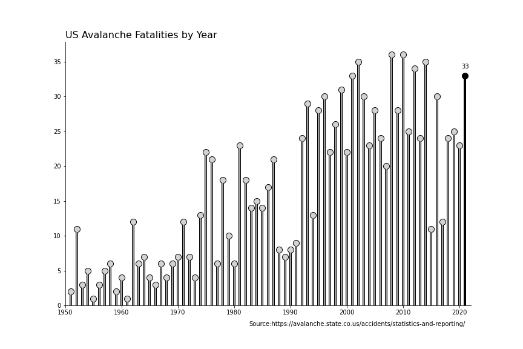
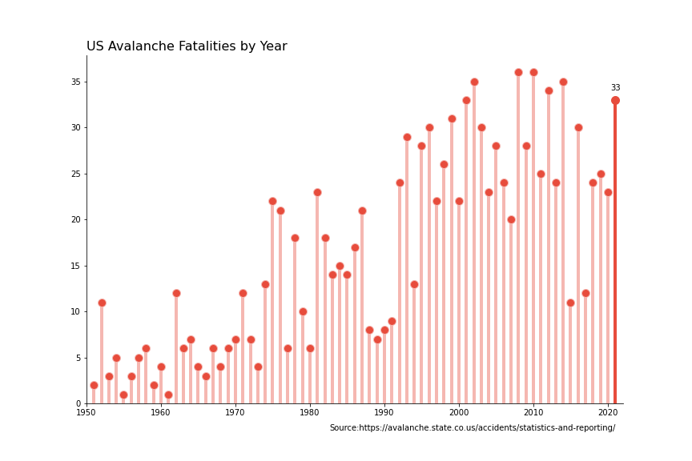

# Lollipop-charts-matplotlib
A simple guide on how to draw lollipop charts with Python's Matplotlib

## Data Source:
https://avalanche.state.co.us/accidents/statistics-and-reporting/

## Article:

## Results:

